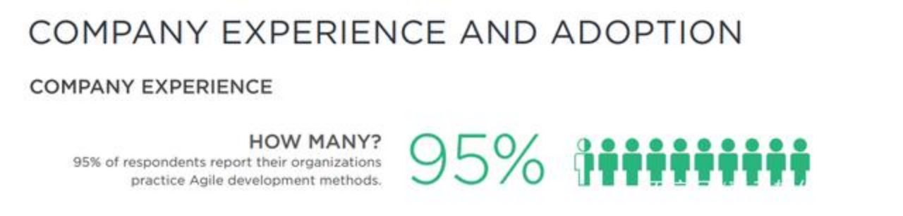
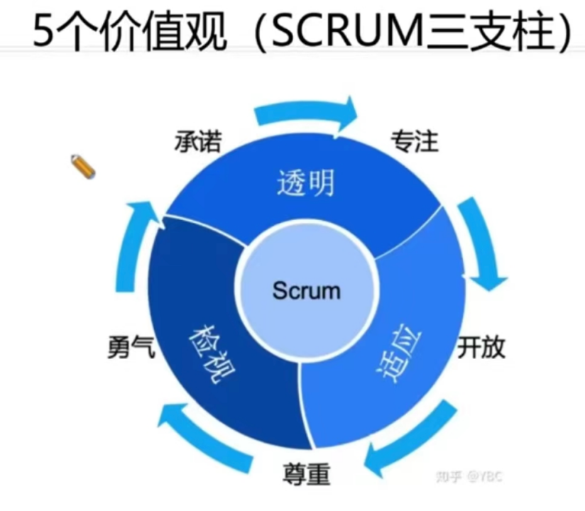

《敏捷开发》的核心与实战价值
持续、频繁、灵活、快速的项目管理方法论下的价值交付

郭庆峰 2023.02

一、为什么要选择敏捷？
二、敏捷开发的运作模式
三、什么是敏捷开发？
四、思考题：如何选择适用的项目管理？
五、看板工具介绍
六、敏捷与devops
七、分享敏捷的网站、工具、书籍、考试途径、心得体会等；

一、为什要选择敏捷？
「《敏捷开发》是一种《项目管理》的方式/手段」。
「价值产出、拥抱变化」
价值产出：资源花在刀刃上。
拥抱变化：船小好掉头。

「根据《Scrum中文网—2021敏捷年度状态报告》来看，组织实践敏捷的领域在不断扩张，数据显示敏捷应用在软件开发和IT以外如运营、市场、人力资源、销售/销售运营这几个领域加起来已经达到30%。 」

「95%调查者回应他们的组织已经开始了敏捷实践方法，当然也有82%的调查者表示，他们公司内并不是所有团队都采用敏捷实践，这说明企业级敏捷转型仍有较大的增长空间。」

「敏捷开发的起源，及其在中国软件行业的发展历程」

「2001年2月，17位软件工程领军人物，在在美国犹他州滑雪胜地，共同探寻更好的解决问题方案，最终成立了一个无政府组织，推出了《敏捷软件开发宣言》（Manifesto for Agile Software Development）。参会者们包括来自于极限编程、Scrum、DSDM、自适应软件开发、水晶系列、特征驱动开发、实效编程的代表们，还包括了希望找到文档驱动、重型软件开发过程的替代品的一些推动者」

「在2006年时，对中国软件行业而言，敏捷开发是太过超前了。」
在第十届国际软件博览会上，做了关于敏捷方法的主题演讲，台下报以的是困惑的眼神与尴尬的沉默。每两周一次迭代、每次迭代发布上线给用户使用，既不可能、也不必要。中国的IT业还没有做好迎接敏捷的准备。

「决定性的转机发生在2008年前后。」
2008年前后，通信市场的争夺日趋白热化，4G相关产品的研发已经从原来先有规范后有产品，变成了规范产品同步进行，并且运营商也开始要求越来越多的定制功能。这种竞争态势，使各家大厂把应对需求变化、缩短交付周期放上了研发能力的优先级。

「互联网大厂的敏捷起步也并非一帆风顺。」
2009年，百度把握住谷歌退出中国市场的机遇，全面对标谷歌，包括工程师的工作方式。从单一主干开发模式切入，百度大幅提高了研发过程中的自动化程度，把产品发布周期从几个月一次缩短到了每周一次发布。
迟至2012年，腾讯某些产品还只能做到两三个月发布一次，通过模块解耦、提升自动化水平、拆分特性团队、持续集成等实践，得以逐步缩短发布周期，达到了每天能发布两个可用版本的水平。

「敏捷为什么就能做到拥抱变化、价值产出呢？它是怎么运作的呢？」

二、敏捷开发的运作模式
「瀑布模型是一个经典的软件生命周期模型,也叫预测型生命周期、完全计划驱动型生命周期，遵循项目管理学科中的“五大过程组、十大知识领域”」

「下面这个图片是来自《硝烟中的Scrum和XP》一书，作者Henrik Kniberg通过与瀑布模式的对比形象生动地描述了敏捷开发的理念与实践。」

「每日站会开始之前首先要确认今日站会所需要的三个问题：」
✅ 昨天的任务是否已完成？
✅ 今天的任务有哪些？
✅ 任务中遇到哪些障碍或困惑？
「每日站会的几个特性」
1、不能超过15分钟。
2、不解决任何问题！
3、不允许团队成员外的人干预会议（但可以旁听）！

「每日站会与看板工具」

「我如何判断我当下的事情是否“敏捷”呢？」

三、什么是敏捷开发？

「敏捷宣言」

「敏捷十二原则」

「敏捷开发的“3355”」
3 敏捷的三个角色  - sm（scurm master） po（product owner） dev team（开发团队“一个Pizza原则”）
3 个工件 - 产品代办清单、迭代代办清单、潜在可发布产品增量
5 个关键事件 - 需求评审会 计划会、每日站会、迭代评审会、回顾会
5 个价值观 
开放- Scrum把项目中的一切开放给每个人看
尊重- 每个人都有他独特的背景和经验
勇气- 有勇气做出承诺，履行承诺，接受别人的尊重
专注- 把你的心思和能力都用到你承诺的工作上去
承诺- 愿意对目标做出承诺，全身心投入去完成Scrum团队的目标，而不是必须按计划完成，两者之间是有区别的

四、思考题：如何选择适用的项目管理？
「？？思考：给房子装修应该敏捷吗🤔？」
A.敏捷
B.瀑布型（预测型）
C.混合型   
D.都可以

「敏捷只是一种方法，不是解决所有项目管理问题的终点。」

五、敏捷项目管理的工具介绍
「如何编写用户故事」

「看板工具，
演示链接：https://www.leangoo.com/kanban/board/go/4627766#/board_view」
国内流行的看板工具：领歌-leangoo、腾讯-tapd、禅道、PingCode、华为软开云、复临-ones、

「看板工具-燃尽图」

「每日站会、回顾会议、Sprint/迭代计划会议、Sprint/迭代评审、短迭代成为Top5的敏捷管理实践。-《Scrum中文网—2021敏捷年度状态报告》」

六、精益与敏捷-DevOps
DevOps 是 Development 和 Operations 的合成词，其目标是要加强开发人员、测试人员、运维人员之间的沟通协调。如何实现这一目标呢？需要我们的项目做到持续集成、持续交付、持续部署。
时下流行的 Jenkins、Bamboo，就是两款优秀的持续集成工具。而 Docker 容器则为 DevOps 提供了强大而有效的统一环境。

七、敏捷的网站、机构、工具、书籍、考试途径等；
1、敏捷网站：
1.1 scrum中文网：https://www.scrumcn.com/agile/scrum-knowledge-library/scrum.html

2、工具
2.1 《框架》-scrum、devops、看板（流程化敏捷）、短迭代、FDD、XP等等。
2.2 《看板》-leangoo、tapd

专业认证
《PMP》《软考》《ACP》
PMI-ACP（PMI敏捷项目管理专业人士）考试是由项目管理协会(PMI®)于2011年推出一门敏捷项目管理的考试， PMI-ACP证书是PMI在全球206个国家和地区范围内，发起的针对敏捷实践者的资格认证。该认证是目前国际上敏捷领域，知识方法内容全面、含金量高、认可度广的证书。PMI-ACP证书特别验证了从业者在项目工作中理解及实施敏捷管理原则与实践的能力。

参考文献：
1、《硝烟中的Scrum和XP》一书，作者Henrik Kniberg
2、《疫情之下2021敏捷年度状态报告十大看点》，Scrum中文网，https://blog.csdn.net/leangoo/article/details/121682766
3、《敏捷在中国这十五年》-Thoughtworks商业洞见，知乎，https://zhuanlan.zhihu.com/p/35832896

话题分享：
《日拱一卒，大厂都在推崇的敏捷开发究竟是人还是工具至上？》作者：王若林，36氪企服点评，https://baijiahao.baidu.com/s?id=1710121904861385773&wfr=spider&for=pc
《Google、IBM等一线大厂都在用的敏捷开发到底是什么？丨极客时间》，InfoQ，有内容的技术社区媒体，https://www.163.com/dy/article/F29Q8JP70511D3QS.html
《揭秘：Scrum Master 的一天是怎样的体验？》， Scrum中文网，Aka，https://www.scrumcn.com/agile/scrum/26066.html

